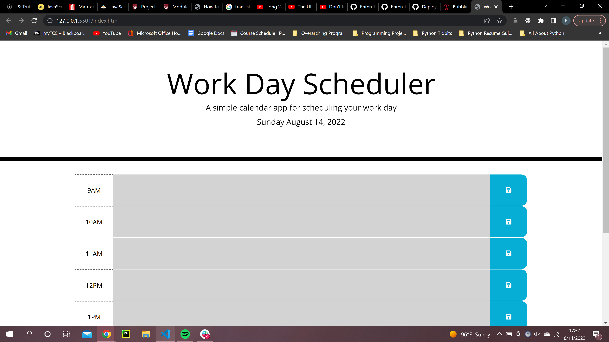

# Calender For The Day

Author: Ehren Lewis

# About This Project
The motivation for this project was I needed a website that would function as a to do list. Since websites have local storage, I felt as if that would be a greate way to keep track of my data and what I needed to achieve during my work hours.

I built this project to allow for I or others to keep track of their items that they have to do throughout the work day.

As well, this project was built with HTML, CSS, Bootstrap, Javascript, and JQuery.

I learned about how to use getting and setting items to local storage, how to have different keys in local storage, how to use JQuery to dynamically create elements as well as embed elements into the DOM. I also learned how to use the Date module to display the current day as well.

known issues: There is nothing set for mobile responsiveness, so there may be an issue on viewing it on smaller screens.

For future versions: I would like to allow users to view preivous days, but perhaps those days will be uneditable since the day has passed, as well as change the storage from local storage to a database.

# How to Install

1. Navigate to the code repository
2. Press the green code button, located near the about section
3. Copy either the HTTPS, Git CLI, download the zip, open with GitHub desktop, or copy the SSH link.
4. Depending on download method, use Git, executable, or the desktop application to open the content files
5. All of the content of the repository will be available after completion of the previous state.

# OR

1. Visit the live site
2. Copy the files from the developer tools into your own files

link to repository: https://github.com/Ehren-Lewis/CalenderForTheDay
link to live site: https://ehren-lewis.github.io/CalenderForTheDay/

# Usage

This project is to be used as a production tool. 
Each day has a different reference to local storage so no 2 days will collide. The user will see on the left every hour in a typical work day (9AM to 5PM), in the middle a text area that they can modify so they know what to do during that hour, as well as a save feature on the right so this information can be retrieved later in the day. 

